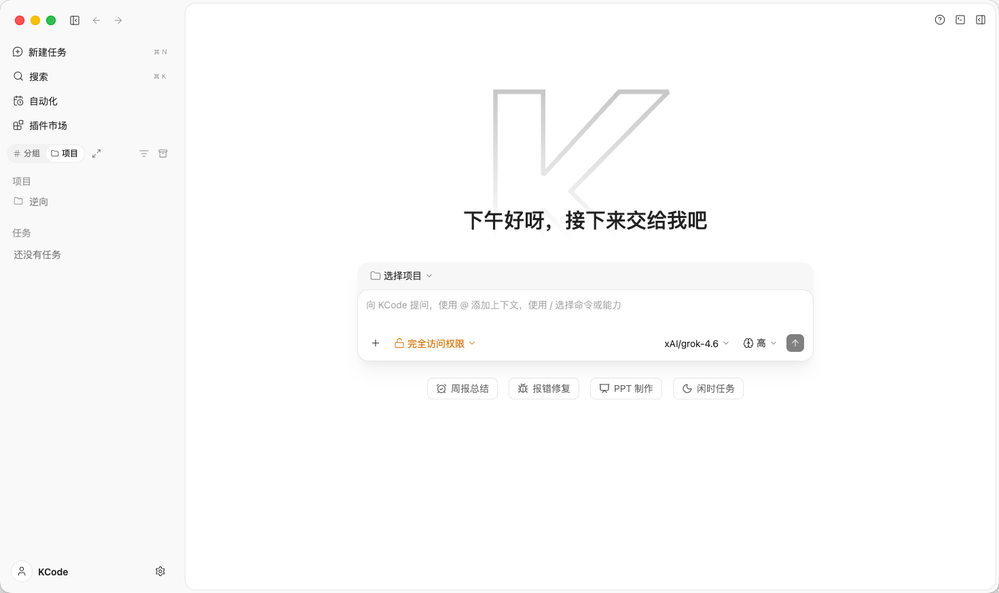

# KCode

  

  <a href="README.md">简体中文</a> | English

  

  
  
  
  

  
  
  

  

**KCode** is an open-source AI coding workspace with a desktop app, a browser UI, and a terminal Agent. Configure your own model providers.

## Install

Installers are on [GitHub Releases](https://github.com/7836246/kcode/releases/latest). They are unsigned and usable after download.

- **macOS**: If it says the app is damaged, run `xattr -dr com.apple.quarantine /Applications/KCode.app`
- **Windows**: If SmartScreen does not recognize it, choose More info → Run anyway
- **Linux**: `chmod +x` the AppImage, or install the deb / rpm

Full steps: [Install docs](https://kcode.wiki/docs/install).

## Upstream

Compared with the public [ZCode](https://github.com/zai-org/ZCode) source, KCode mainly changes the following:

- Product name, icons, commands, and environment variables are unified as KCode
- Zhipu / Z.ai login, OAuth, plan, and upgrade implementations are removed; you configure providers yourself
- The official plugin catalog is bundled in-repo and no longer fetched from the Z.ai CDN
- Plugin Creator is bundled; Settings can enable and edit a custom system role
- Approval and Plan follow this repo's product rules

## Disclaimer

This project is for learning and reference only. It does not guarantee availability or safety, and it is not an official service.

## License

Apache-2.0. The source comes from upstream [ZCode](https://github.com/zai-org/ZCode). Copyright belongs to Z.AI Co., Ltd. See [NOTICE.md](NOTICE.md) for feature boundaries, execution risk, data handling, and third-party copyright.
